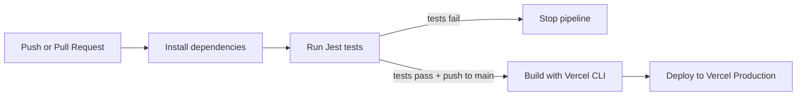

# Zura DevOps CI/CD Pipeline

Minimal **Node.js + Express** application for the CI/CD Pipeline Automation & Deployment Strategies assignment. The project uses **GitHub Actions** for CI/CD and **Vercel free tier** for hosting.

The important rule is enforced in the workflow: **deployment runs only after automated tests pass**.

## Live Application Link

Replace this after the first successful Vercel deployment:

- Production: `https://<your-vercel-project>.vercel.app`

## Screenshots

Add screenshots before submission:

```markdown


```

Recommended screenshots:

- Browser showing the hosted Vercel application at `/`.
- Browser showing the health endpoint at `/health`.
- GitHub Actions showing a green `CI/CD` workflow with `Install & test` and `Deploy to Vercel`.

## Application Overview

This app intentionally stays small because the assignment is graded on delivery automation, not application complexity.

| Path | Purpose |
| --- | --- |
| `src/app.js` | Express application and routes. |
| `src/server.js` | Local development server for `npm start`. |
| `api/index.js` | Vercel serverless entrypoint. |
| `tests/health.test.js` | Jest + Supertest tests. |
| `vercel.json` | Routes Vercel traffic to the serverless Express app. |
| `.github/workflows/main.yml` | CI/CD workflow. |

## Local Development

```bash
npm ci
npm test
npm start
```

Local URL:

```text
http://localhost:3000
```

Health check:

```text
http://localhost:3000/health
```

## Pipeline Description

The workflow is defined in `.github/workflows/main.yml`.

### Continuous Integration

CI runs on every:

- `push`
- `pull_request`

The `test` job:

1. Checks out the repository.
2. Installs Node.js 20.
3. Installs dependencies with `npm ci`.
4. Runs the Jest test suite with `npm test`.

If any test fails, the `test` job fails and the pipeline stops.

### Continuous Deployment

CD runs only when all of these are true:

- The `test` job succeeded.
- The event is a `push`.
- The branch is `main`.

The `deploy` job uses the Vercel CLI:

1. `npx vercel pull --yes --environment=production`
2. `npx vercel build --prod`
3. `npx vercel deploy --prebuilt --prod`

Because the deploy job has `needs: test`, GitHub Actions will not deploy broken code.



## Vercel Deployment Setup

### 1. Create the Vercel project

1. Go to [Vercel](https://vercel.com/).
2. Create a new project and import this GitHub repository.
3. Use the default Node.js settings.
4. Keep the project connected to GitHub, but make sure production deployment is controlled by GitHub Actions.

To satisfy the assignment rule strictly, avoid letting Vercel deploy directly on every push before tests run. Use one of these approaches:

- Set Vercel's Git deployment behavior to ignore automatic deployments and let GitHub Actions deploy with the CLI.
- Or configure Vercel's ignored build step so Vercel skips Git-triggered builds, while Actions still deploys using `vercel deploy`.

### 2. Create a Vercel token

1. In Vercel, open **Account Settings**.
2. Go to **Tokens**.
3. Create a token for this project.

### 3. Add GitHub Actions secrets

In GitHub, open the repository:

`Settings` → `Secrets and variables` → `Actions` → `New repository secret`

Add these secrets:

| Secret | Purpose |
| --- | --- |
| `VERCEL_TOKEN` | Vercel API token used by GitHub Actions. |
| `VERCEL_ORG_ID` | Vercel team/user ID. |
| `VERCEL_PROJECT_ID` | Vercel project ID. |

The easiest way to get `VERCEL_ORG_ID` and `VERCEL_PROJECT_ID` is:

```bash
npx vercel link
```

After linking locally, Vercel creates `.vercel/project.json`. Copy the `orgId` and `projectId` values into GitHub secrets. Do not commit `.vercel/`.

## Deployment Strategy

### Chosen Strategy: Rolling Deployment

Vercel is a serverless platform. It does not update one long-running server in place. Instead, every production deployment creates a new immutable deployment.

For this assignment, the chosen strategy is a **rolling deployment simulated through Vercel production promotion**:

1. GitHub Actions runs tests first.
2. If tests pass on `main`, the workflow builds a new Vercel production artifact.
3. Vercel deploys the new immutable version.
4. Vercel routes production traffic to the new deployment.
5. The previous deployment remains available in Vercel history for rollback.

This is logical for Vercel free tier because Vercel handles release promotion and keeps older deployments without requiring us to manage servers manually.

## Rollback Guide

Use this if a bug is discovered in production.

### Option A: Roll back from the Vercel dashboard

1. Open the Vercel dashboard.
2. Select the project.
3. Go to the **Deployments** tab.
4. Find the last stable deployment before the bad release.
5. Open the deployment menu.
6. Choose **Promote to Production**.
7. Wait for Vercel to update production.
8. Verify `/` and `/health` in the browser.

### Option B: Roll back through GitHub Actions

1. Revert the bad commit or merge commit on `main`.
2. Push the revert to GitHub.
3. GitHub Actions runs tests again.
4. If tests pass, the workflow deploys the reverted version to Vercel production.
5. Verify the live application.

Option A is fastest during an incident. Option B keeps Git history aligned with production.

## Reliability Check

This repository satisfies the assignment requirements:

| Requirement | Implementation |
| --- | --- |
| GitHub repository | Project is ready to push to GitHub. |
| Testing suite | Jest + Supertest. |
| CI on push and pull request | `.github/workflows/main.yml`. |
| Deployment only after tests pass | `deploy` has `needs: test`. |
| Free-tier hosting | Vercel. |
| Update strategy | Rolling deployment using immutable Vercel deployments. |
| Rollback protocol | Vercel deployment promotion or Git revert. |

## Initial GitHub Push

```bash
git add .
git commit -m "Add Vercel CI/CD pipeline"
git branch -M main
git remote add origin https://github.com/<your-user>/<your-repo>.git
git push -u origin main
```

After deployment succeeds, update the live URL and add the required screenshots.
