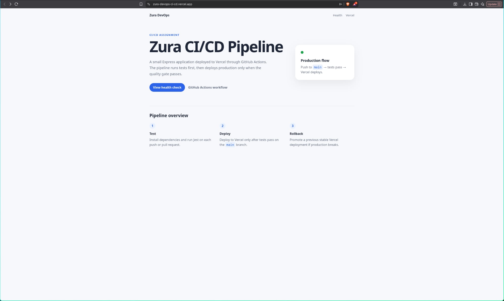
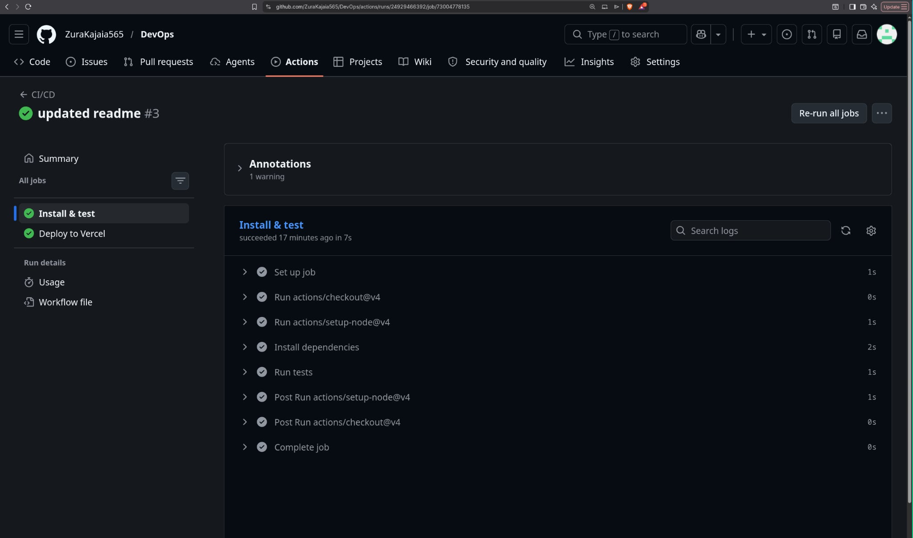
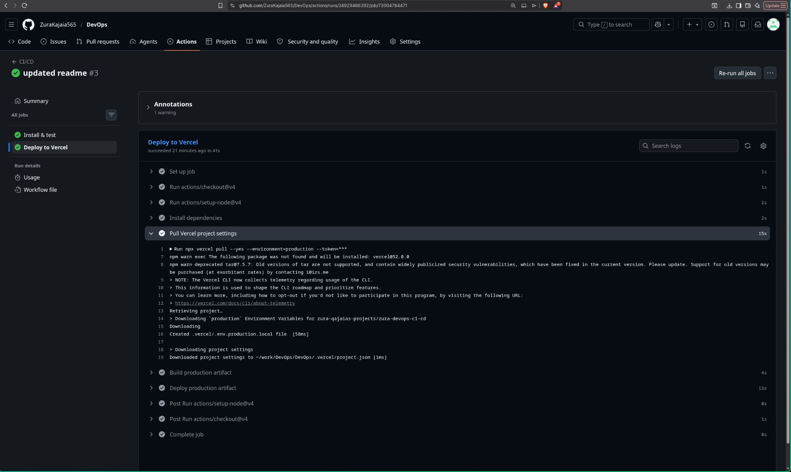
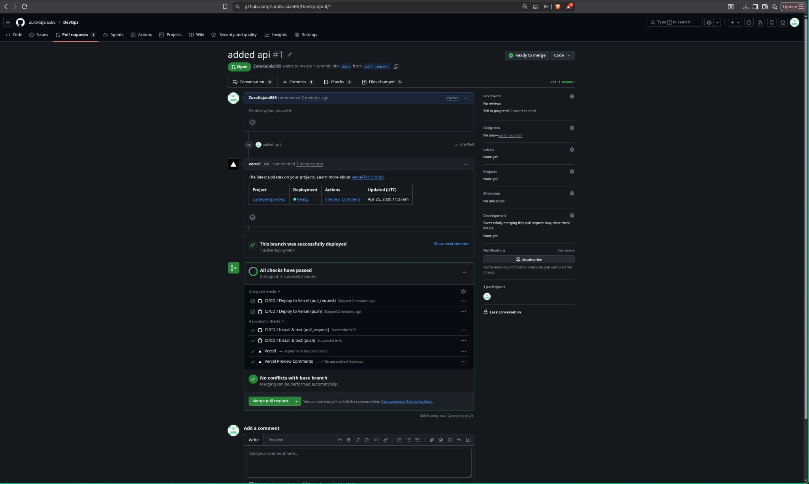

# Zura DevOps CI/CD Pipeline

Minimal **Node.js + Express** application for the CI/CD Pipeline Automation & Deployment Strategies assignment. The project uses **GitHub Actions** for CI/CD and **Vercel free tier** for hosting.

The important rule is enforced in the workflow: **deployment runs only after automated tests pass**.

## Live Application Link

Replace this after the first successful Vercel deployment:

- Production: `https://zura-devops-ci-cd.vercel.app/`

## Screenshots




<<<<<<< HEAD
=======

>>>>>>> 5c4f35f (final version)

## Application Overview

This app intentionally stays small because the assignment is graded on delivery automation, not application complexity.

| Path | Purpose |
| --- | --- |
| `src/app.js` | Express application and routes. |
| `src/server.js` | Local development server for `npm start`. |
| `api/index.js` | Vercel serverless entrypoint. |
| `tests/health.test.js` | Jest + Supertest tests. |
| `vercel.json` | Routes Vercel traffic to the serverless Express app. |
| `.github/workflows/main.yml` | CI/CD workflow. |

## Local Development

```bash
npm ci
npm test
npm start
```

Local URL:

```text
http://localhost:3000
```

Health check:

```text
http://localhost:3000/health
```

## Pipeline Description

The workflow is defined in `.github/workflows/main.yml`.

### Continuous Integration

CI runs on every:

- `push`
- `pull_request`

The `test` job:

1. Checks out the repository.
2. Installs Node.js 20.
3. Installs dependencies with `npm ci`.
4. Runs the Jest test suite with `npm test`.

If any test fails, the `test` job fails and the pipeline stops.

### Continuous Deployment

CD runs only when all of these are true:

- The `test` job succeeded.
- The event is a `push`.
- The branch is `main`.

The `deploy` job uses the Vercel CLI:

1. `npx vercel pull --yes --environment=production`
2. `npx vercel build --prod`
3. `npx vercel deploy --prebuilt --prod`

Because the deploy job has `needs: test`, GitHub Actions will not deploy broken code.

## Vercel Deployment Setup

### 1. Create the Vercel project

1. Go to [Vercel](https://vercel.com/).
2. Create a new project and import this GitHub repository.
3. Use the default Node.js settings.
4. Keep the project connected to GitHub, but make sure production deployment is controlled by GitHub Actions.

To satisfy the assignment rule strictly, avoid letting Vercel deploy directly on every push before tests run. Use one of these approaches:

- Set Vercel's Git deployment behavior to ignore automatic deployments and let GitHub Actions deploy with the CLI.
- Or configure Vercel's ignored build step so Vercel skips Git-triggered builds, while Actions still deploys using `vercel deploy`.

### 2. Create a Vercel token

1. In Vercel, open **Account Settings**.
2. Go to **Tokens**.
3. Create a token for this project.

### 3. Add GitHub Actions secrets

In GitHub, open the repository:

`Settings` → `Secrets and variables` → `Actions` → `New repository secret`

Add these secrets:

| Secret | Purpose |
| --- | --- |
| `VERCEL_TOKEN` | Vercel API token used by GitHub Actions. |
| `VERCEL_ORG_ID` | Vercel team/user ID. |
| `VERCEL_PROJECT_ID` | Vercel project ID. |

The easiest way to get `VERCEL_ORG_ID` and `VERCEL_PROJECT_ID` is:

```bash
npx vercel link
```

After linking locally, Vercel creates `.vercel/project.json`. Copy the `orgId` and `projectId` values into GitHub secrets. Do not commit `.vercel/`.

## Strategy Explanation

### Which Update Strategy did you choose?

I chose a **Blue-Green Deployment strategy (as implemented by Vercel)**.

In this approach, production traffic is always served from a stable “live” environment (production deployment), while new changes are first built and deployed to isolated preview environments.

Once the changes pass testing and are merged into the `main` branch, Vercel automatically promotes the new deployment to production in a single atomic switch.

### Why this strategy?

- Ensures **zero-downtime deployments**
- Allows safe testing through **preview deployments for each pull request**
- Provides a **fast rollback mechanism** (previous deployment remains available)
- Reduces production risk by separating build/test and live traffic

## Implementation of the Strategy

I implemented a **Blue-Green Deployment strategy using GitHub Actions and Vercel** to ensure safe and reliable releases.

### Steps used in the workflow:

1. **Continuous Integration (CI) on every push and pull request**
   - The workflow starts on every `push` and `pull_request`
   - Code is checked out and Node.js environment is set up
   - Dependencies are installed using `npm ci`
   - Automated tests are executed using `npm test`
   - This ensures only tested code can proceed to deployment

2. **Controlled deployment trigger**
   - Deployment job runs only when:
     - Branch is `main`
     - Event is a `push`
   - This prevents accidental production deployments from feature branches

3. **Vercel environment setup**
   - Project configuration is pulled using `vercel pull`
   - Ensures correct production settings are used during deployment

4. **Production build step**
   - Application is built using `vercel build --prod`
   - Generates a production-ready artifact before deployment

5. **Atomic production deployment**
   - Final deployment is done using `vercel deploy --prebuilt --prod`
   - This replaces the current production version instantly with zero downtime

### Safety considerations:

- Tests must pass before deployment (`needs: test`)
- Only `main` branch can trigger production deployment
- Build is separated from deployment for reliability
- Vercel ensures instant switching between versions (Blue-Green behavior)

## Rollback Guide (Vercel)

If a deployment introduces issues, you can quickly revert to a previous stable version using Vercel’s built-in deployment history.

### Step-by-step rollback process:

1. **Open Vercel Dashboard**
   - Go to https://vercel.com/dashboard
   - Select your project

2. **Navigate to Deployments**
   - Click the **“Deployments”** tab
   - You will see a list of all previous deployments (including production and previews)

3. **Find a stable deployment**
   - Identify a previous deployment that was working correctly
   - You can open it to verify the build and behavior

4. **Promote the previous version**
   - Click the **three dots (•••)** next to the selected deployment
   - Choose **“Promote to Production”**

5. **Confirm rollback**
   - Vercel immediately switches production traffic to the selected deployment
   - No downtime occurs during this process

### Summary

Rollback on Vercel is fast and safe because every deployment is immutable and can be instantly promoted back to production with a single action.

## Reliability Check

This repository satisfies the assignment requirements:

| Requirement | Implementation |
| --- | --- |
| GitHub repository | Project is ready to push to GitHub. |
| Testing suite | Jest + Supertest. |
| CI on push and pull request | `.github/workflows/main.yml`. |
| Deployment only after tests pass | `deploy` has `needs: test`. |
| Free-tier hosting | Vercel. |
| Update strategy | Rolling deployment using immutable Vercel deployments. |
| Rollback protocol | Vercel deployment promotion or Git revert. |

## Initial GitHub Push

```bash
git add .
git commit -m "Add Vercel CI/CD pipeline"
git branch -M main
git remote add origin https://github.com/<your-user>/<your-repo>.git
git push -u origin main
```

After deployment succeeds, update the live URL and add the required screenshots.
